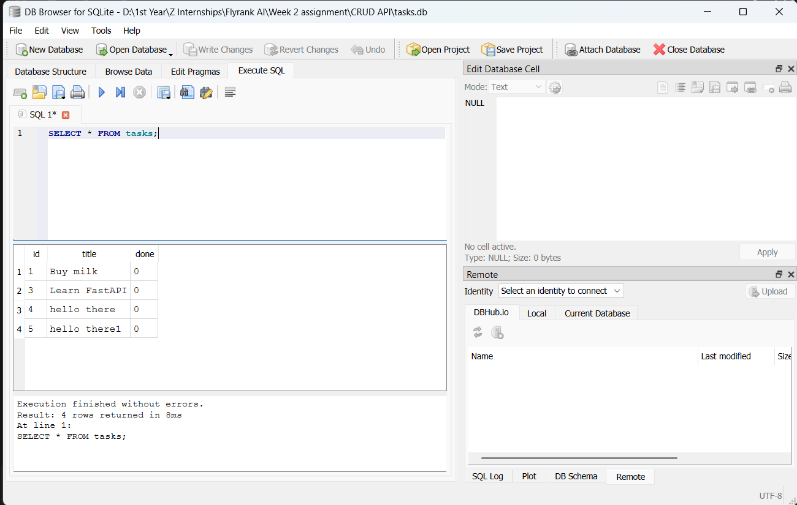

Database-Backed Task API

This is a complete CRUD API for managing a to-do list, built with Python, FastAPI, and SQLite. 

Why SQLite & Database Details
SQLite was chosen because it is serverless, requires zero setup, and stores the entire database in a single file (`tasks.db`). This gives the API **persistence**, meaning data survives server restarts (unlike the previous in-memory version). 

The database file `tasks.db` is added to `.gitignore` so every fresh clone starts clean. When you start the server for the first time, it automatically creates the database, creates the `tasks` table, and seeds it with 3 example tasks.

How to Run

To start the server on localhost, run:
```bash
uvicorn main:app --reload
You can view and interact with the endpoints at http://localhost:8000/docs.
Endpoints
Method	Path	Description
GET	/	API info
GET	/health	Health check
GET	/tasks	List all tasks
GET	/tasks/{id}	Get a specific task
POST	/tasks	Create a new task
PUT	/tasks/{id}	Update a task
DELETE	/tasks/{id}	Delete a task
GET	/stats	Get task statistics
Example Request
Here is an example of fetching the health endpoint:
code
JSON
{
  "status": "ok"
}
Stage 4 SQL Query Observation
I ran SELECT COUNT(*) FROM tasks; directly in DB Browser, and it returned the total number of tasks currently in my database file.
Screenshots
Swagger UI:

DB Browser for SQLite:

