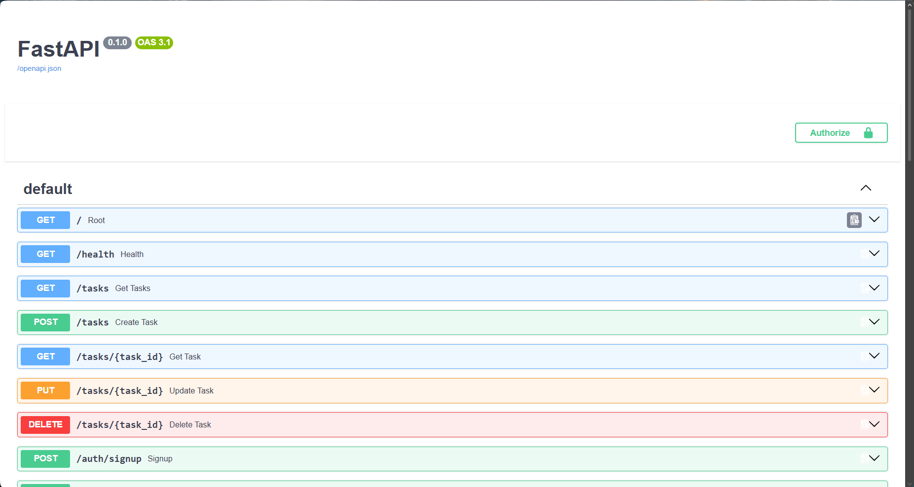

This is a complete CRUD API for a to-do list, secured with **Supabase Authentication**. It handles user sign-up, login, logout, and uses **JSON Web Tokens (JWTs)** to protect secure routes. 

## Security Features
- Passwords are never stored or hashed locally; Supabase acts as our Identity Provider.
- Protected routes use a reusable FastAPI `Depends` middleware to verify Bearer tokens cryptographically.
- Swagger UI is configured with `HTTPBearer` to allow easy token authorization in the browser.

## Environment Setup
**CRITICAL:** Never commit your actual Supabase keys.
1. Clone the repository.
2. Copy the example environment file:
   ```bash
   cp .env.example .env
Fill in your .env file with your Postgres Database URL and your Supabase Project URL / Anon Key.
How to Run
To start the API locally, run:
code
Bash
uvicorn main:app --reload
Access the interactive API documentation at http://localhost:8000/docs.
API Endpoints
Method	Path	Auth Required?	Description
GET	/public/info	❌ No	Public welcome message
POST	/auth/signup	❌ No	Create a new user account
POST	/auth/login	❌ No	Authenticate and receive a JWT
POST	/auth/logout	🔒 Yes	End the user's session
GET	/protected/profile	🔒 Yes	Access private user data
GET	/protected/dashboard	🔒 Yes	Access a private dashboard
(Note: The standard Task CRUD endpoints from previous weeks are still available as well).
Swagger UI Authorization
The API documentation natively supports JWT Bearer Authentication.

code
Code
