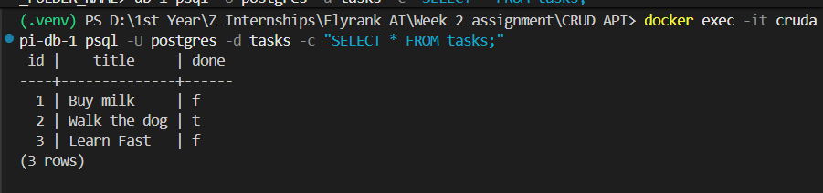

# Containerized Task API

This is a complete CRUD API for a to-do list, built with Python, FastAPI, and PostgreSQL. The entire stack (API + Database) is fully containerized using Docker.

## Why Docker?
By containerizing the application, this API runs identically on any machine without needing to install Python or Postgres directly. A Docker volume ensures that the database data persists even if the containers are destroyed and recreated. Secrets (like the database password) are loaded safely via a `.env` file.

## How to Run

1. Clone this repository.
2. Copy the example environment file to create your own:
   ```bash
   cp .env.example .env
Start the entire stack (API and Postgres database) with one command:
code
Bash
docker compose up
Access the API documentation at http://localhost:8000/docs.
Endpoints
Method	Path	Description
GET	/	API info
GET	/health	Health check
GET	/tasks	List all tasks
GET	/tasks/{id}	Get a specific task
POST	/tasks	Create a new task
PUT	/tasks/{id}	Update a task
DELETE	/tasks/{id}	Delete a task
Example Request
Here is an example of fetching the health endpoint using curl:
code
JSON
{
  "status": "ok"
}
Database Screenshot
Here is a snapshot of the tasks living inside the PostgreSQL container:
